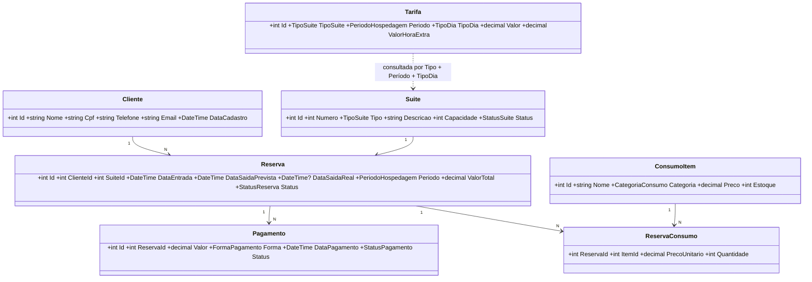

# 🏨 Motel Palace — Back-end em C# (.NET 8)

Sistema de back-end do **Motel Palace**, organizado em camadas e separado por classes.
Foco: regras de negócio de horário, tarifa e consumo. Aplicação de console (menu interativo + demonstração automática).

## Como executar

Requisito: [.NET SDK 8.0+](https://dotnet.microsoft.com/download)

```bash
cd MotelPalace
dotnet run                # menu interativo
dotnet run -- --demo      # roteiro automático que exercita todas as regras
```

## Estrutura de pastas

```
MotelPalace/
├── Program.cs                     # ponto de entrada
├── Enums/                         # TipoSuite, StatusSuite, PeriodoHospedagem, TipoDia,
│                                  # StatusReserva, FormaPagamento, StatusPagamento, CategoriaConsumo
├── Models/                        # as 6 classes + ReservaConsumo (tabela de ligação)
│   ├── Cliente.cs                 # 1
│   ├── Suite.cs                   # 2
│   ├── Reserva.cs                 # 3 (classe central)
│   ├── Tarifa.cs                  # 4
│   ├── ConsumoItem.cs             # 5
│   ├── Pagamento.cs               # 6
│   └── ReservaConsumo.cs          # N:N Reserva ↔ ConsumoItem
├── Repositories/                  # IRepositorio<T> + RepositorioMemoria<T>
├── Services/                      # regras de negócio
│   ├── ClienteService.cs
│   ├── SuiteService.cs            # máquina de estados do status da suíte
│   ├── TarifaService.cs
│   ├── ConsumoItemService.cs
│   ├── ReservaService.cs          # ⭐ coração do sistema
│   ├── PagamentoService.cs
│   ├── CalendarioService.cs       # dia útil / fim de semana / feriado (inclui feriados móveis)
│   └── RelatorioService.cs
├── Dtos/ContaReserva.cs           # extrato da conta
├── Exceptions/                    # RegraDeNegocioException, EntidadeNaoEncontradaException
├── Utils/                         # CpfValidador, Validacoes, Formatar, IRelogio (relógio simulado)
├── Data/                          # MotelSistema (composição) e DadosIniciais (seed)
└── UI/                            # MenuPrincipal, Demonstracao, Entrada, Saida
```

## Diagrama de classes



## Relacionamentos

| Relação | Implementação |
|---|---|
| Cliente 1:N Reserva | `Reserva.ClienteId` |
| Suíte 1:N Reserva | `Reserva.SuiteId` |
| Reserva 1:N Pagamento | `Pagamento.ReservaId` |
| Reserva N:N ConsumoItem | `ReservaConsumo` (guarda preço unitário no momento do lançamento) |
| Tarifa ↔ Suíte | consulta por `TipoSuite` + `PeriodoHospedagem` + `TipoDia` |

## Regras de negócio implementadas

1. **Bloqueio de reserva:** suíte ocupada, em manutenção ou em limpeza não pode ser reservada; o cliente também não pode ter duas hospedagens ativas.
2. **Valor pela tarifa:** período + tipo de suíte + tipo de dia (dia útil, fim de semana ou feriado) + soma do consumo.
   - Sexta-feira a partir das 18h já conta como fim de semana.
   - Feriados nacionais fixos e móveis (Carnaval, Sexta-feira Santa, Corpus Christi) calculados pela Páscoa.
   - Sem tarifa específica de feriado → aplica a de fim de semana.
3. **Hora extra:** após a saída prevista, tolerância de 10 min; depois disso cada hora iniciada é cobrada pelo `ValorHoraExtra` da tarifa.
4. **Estoque:** ao lançar consumo o estoque é baixado; estoque insuficiente bloqueia o lançamento.
5. **Finalização:** exige conta quitada; a suíte vai automaticamente para **Limpeza** e só volta a ficar Disponível quando a limpeza é concluída.
6. **Cancelamento:** só reservas ativas e sem consumo; pagamentos confirmados são estornados e a suíte é liberada.
7. **Pagamentos:** aceita pagamento dividido (várias formas), não aceita valor acima do saldo devedor.

## Se o professor exigir exatamente 6 classes

Basta remover `Tarifa` e colocar um atributo `Valor` (por período) dentro de `Suite`. `ReservaConsumo` é apenas a tabela de ligação do N:N.

## Ideias de evolução

- Trocar `RepositorioMemoria<T>` por Entity Framework Core (a interface `IRepositorio<T>` já isola a persistência).
- Expor os serviços por uma Web API (ASP.NET Core).
- Testes unitários com xUnit sobre `ReservaService`.
